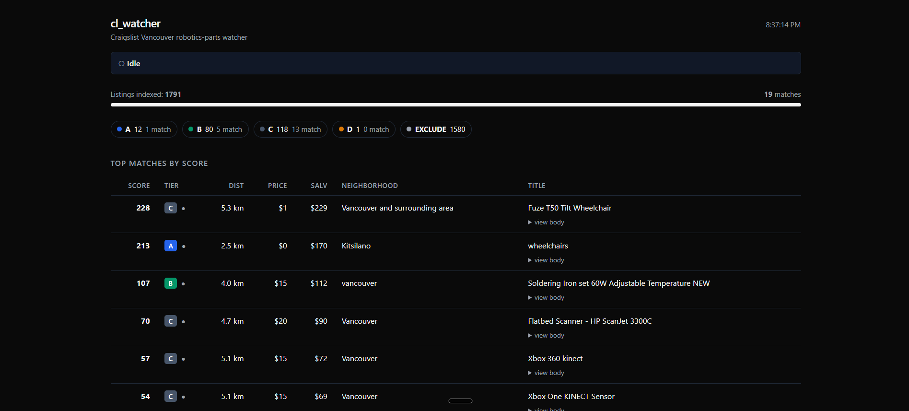

# Salvage Radar

Two-stage data pipeline that turns Vancouver Craigslist listings into a short, sorted shopping list. The first stage (`cl_watcher/`, this directory's code) scrapes every listing under $30 within ~10 km of UBC. The second stage ([`appraiser/`](appraiser/)) hands them to parallel Claude Code subagents that identify the salvageable components, estimate parts-out value, and rank by profit-per-km.

Built to find broken electronics — 3D printers, hoverboards, scopes, robot vacuums — with salvage value 2–3× the asking price. Runs locally on a laptop subscription; about **3 million tokens** to appraise 2,000 listings end to end, no API keys, no cloud bill.


*Live-scan dashboard at `localhost:8765` while cl_watcher fetches Craigslist RSS feeds and enriches each listing with neighborhood, distance from Dunbar, and a heuristic salvage estimate.*

---

## Stage 1 — `cl_watcher` (this directory)

Local agent that watches **Craigslist Vancouver** for free / cheap salvageable electronics and robotics parts near a target neighborhood (Dunbar / UBC by default), scores listings against estimated parts-salvage value, filters by precise map-pin geography, and emails a digest only when something worth picking up appears.

Originally written for me to find free printers, e-bikes, hoverboards, robot vacuums, treadmill motors, etc. close to UBC. Easy to retarget to any Craigslist region and any item set.

## What it does

- **36 default search terms** (free section + paid ≤ $30) across motors, microcontrollers, mobility devices (e-bike / hoverboard / e-scooter / VESC), robot vacuums, drones, RC, lab gear, and more
- **Per-listing enrichment**: fetches each listing page, extracts title, body text, asking price, neighborhood, **lat/long from the map pin**, and Craigslist's structured `condition` / `make` / `model` attributes
- **Precise haversine geo classification**: tiers listings A → D by km from the target point, with hard-exclude rules for boundaries that distance alone misses (e.g. east of Cambie, north of Lions Gate, south of Fraser)
- **Title-primary salvage scoring** with brand boosts, condition modifiers, accessory-only kill words, buyer / trader filtering, quantity detection
- **Local web dashboard** (Python stdlib only, no Node) at `http://localhost:8765` showing live progress, top matches, and full body / attributes per listing
- **Email digests** via Gmail SMTP — only fires when there are matches, max one email per 15-min run
- **Re-scoring**: tune the rules, run `rescore.py --no-fetch`, dashboard updates instantly. Periodic `rescore.py` (with network) re-fetches bodies/attrs for any listings missing them.

## Quick architecture

```
config.py        Search terms, salvage table, geo tiers, decision rules, killers
fetcher.py       HTML search page scraper + per-listing detail enrichment
scoring.py       Salvage estimator, geo classifier (haversine + string), notify decision
storage.py       SQLite persistence + idempotent migrations
watcher.py       Main entrypoint: fetch → dedup → enrich → score → notify
email_sender.py  Gmail SMTP digest
dashboard.py     Local web server with phase, progress bars, match tables
live_view.py     Terminal dashboard (alternative to web)
rescore.py       Re-evaluate every row (optional body re-fetch)
send_rescored_email.py  One-shot manual digest send
register_task.ps1  Windows Task Scheduler installer (15-min cadence)
```

State (DB, logs, secrets) lives at `%LOCALAPPDATA%\cl_watcher\` — outside any cloud-sync folder so SQLite WAL doesn't conflict with sync.

## Quickstart (Windows)

### 1. Clone and install

```powershell
git clone https://github.com/<your-username>/cl-watcher.git
cd cl-watcher
python -m venv .venv
.\.venv\Scripts\Activate.ps1
pip install -r requirements.txt
```

If activation is blocked once: `Set-ExecutionPolicy -Scope CurrentUser -ExecutionPolicy RemoteSigned`.

### 2. Generate a Gmail app password

1. Enable 2-Step Verification: <https://myaccount.google.com/security>
2. Create an app password: <https://myaccount.google.com/apppasswords>
3. Copy the 16-character password.

### 3. Create the .env

Put this in `%LOCALAPPDATA%\cl_watcher\.env`:

```
GMAIL_USER=youraddress@gmail.com
GMAIL_APP_PASSWORD=xxxx xxxx xxxx xxxx
# Optional overrides (default to GMAIL_USER):
# CL_EMAIL_TO=alerts@example.com
# CL_EMAIL_FROM=youraddress@gmail.com
```

The folder is auto-created on first run.

### 4. Retarget for your area (optional)

Edit `config.py`:

- `CL_BASE = "https://vancouver.craigslist.org"` → your Craigslist subdomain
- `DUNBAR_LAT`, `DUNBAR_LON` → coordinates of your search center
- `TIER_A_KM ... TIER_D_KM` → radius bands you care about
- `EAST_BOUNDARY_LON`, the lat/lon hard-exclude rules in `scoring.classify_geo_by_coords` → adjust to your local geography
- `SEARCH_TERMS` → things you actually want
- `SALVAGE_TABLE`, `NEGATIVE_TITLE_KILLERS` → calibrate to your local market

### 5. First run

```powershell
.\.venv\Scripts\python.exe watcher.py
```

The first run does a full backfill (typically 1500–2000 listings, ~35 min wall clock at 1.5 s/request). It'll send a confirmation email when done — even if no matches surface.

### 6. Schedule it

```powershell
.\register_task.ps1
```

Runs every 15 minutes whenever the user is logged in (Interactive logon — no admin needed). For 24/7 operation, edit the script to use `-LogonType S4U -RunLevel Highest` and run as Administrator.

### 7. Watch live

```powershell
# Local web dashboard
.\.venv\Scripts\python.exe dashboard.py
# → open http://localhost:8765

# Or terminal dashboard
.\.venv\Scripts\python.exe live_view.py

# Or tail the watcher log
Get-Content "$env:LOCALAPPDATA\cl_watcher\log\watcher.log" -Wait -Tail 50
```

## Data captured per listing

Stored in SQLite at `%LOCALAPPDATA%\cl_watcher\state.db`:

| Column | Source |
|---|---|
| `rss_id` | listing URL (PK, dedup) |
| `title`, `body` | listing page (full text) |
| `attributes` | JSON of Craigslist `.attrgroup` (condition / make / model / dimensions) |
| `link`, `posted_at`, `section` (free vs paid) | URL + listing page |
| `ask_price`, `price_uncertain` ("make me an offer" / OBO detection) | listing page |
| `neighborhood`, `latitude`, `longitude` | listing page header + map div |
| `distance_km`, `tier`, `geo_source` | derived (haversine + string fallback) |
| `salvage_estimate`, `score`, `notified` | derived (re-runnable via `rescore.py --no-fetch`) |

Raw fields are persistent; derived fields are recomputable, so you can tune rules and rescore without touching the network.

## Tuning loop

```powershell
# Edit config.py — adjust salvage values, killers, brand boosts, etc.
.\.venv\Scripts\python.exe rescore.py --no-fetch    # ~2 sec, no network
# Refresh dashboard, see new top matches.

# To populate body / attributes for any rows that haven't been enriched yet:
.\.venv\Scripts\python.exe rescore.py    # network-bound, slow
```

## Useful commands

```powershell
# Force a run now
Start-ScheduledTask -TaskName ClWatcher

# Pause / resume / remove
Disable-ScheduledTask -TaskName ClWatcher
Enable-ScheduledTask  -TaskName ClWatcher
Unregister-ScheduledTask -TaskName ClWatcher -Confirm:$false

# Send a one-shot digest of current matches without waiting for new listings
.\.venv\Scripts\python.exe send_rescored_email.py
```

## Caveats

- Craigslist has no official API. The HTML scraper relies on the `.cl-static-search-result` block in their no-JS fallback page; if Craigslist changes their HTML, the fetcher needs updating.
- Salvage estimates are heuristics, not market prices — they need a tuning pass against your local market.
- The default 1.5 s request delay is polite throttling. Don't lower below ~0.7 s or you risk an IP-level block.
- Free listings get scooped in minutes. The 15-min cadence catches most but not all — going faster comes with rate-limit risk.

---

## Stage 2 — appraiser (data-analysis pipeline)

The watcher above gives you ~2,000 listings. That's too many to read by hand, and naïve keyword filters lose maybe 40% of the relevant ones to vocabulary drift ("RPi 4" doesn't match "raspberry pi", "lab DC source" doesn't match "bench psu", "WTB" doesn't match "wanted to buy"). The appraiser is a four-layer pipeline that mixes deterministic filters with semantic embeddings and LLM judgment, layering them so each stage is cheap before the expensive one.

```
state.db   (~2,000 listings, every 15 min new ones arrive)
    │
    │  [1. Distance prefilter]   drop > 10 km from Dunbar
    │  [2. Price prefilter]      drop ask > $30
    │  [3. Buyer-post detector]  drop "WTB / ISO / looking for"
    │                            (substring + cosine-similarity against
    │                             pre-embedded buyer phrases)
    │  [4. Excluded-category]    drop bicycles, office chairs,
    │                            CRT TVs, loose lithium
    │  [5. Non-electronics]      drop vinyl, jewelry, clothing, furniture,
    │                            books, kitchenware, hand tools, sports,
    │                            decor — with mechanical-salvage exception
    │                            for gears, linear rails, CNC frames
    │  [6. Accessory-only]       drop "filament", "drone props",
    │                            "ebike battery only"
    │
    ▼
appraiser/batches/batch_NNN.json   (chunks of 100 listings)
    │
    │  [N parallel subagents]    Claude Code spawns 5–8 subagents,
    │                            each handles one batch using
    │                            agent_brief.md (compact prompt) +
    │                            criteria.md (full reference, only read
    │                            on borderline calls)
    │
    ▼
appraiser/results/batch_NNN.json   (per-component salvage ranges)
    │
    │  [aggregate.py]            sum line items, apply rules.decide()
    │                            with distance-tier multipliers
    │
    ▼
appraisal.db   (final appraisals — BUY / MAYBE / SKIP, per-line
               breakdown, full rule trace per row)
```

### Where the filtration actually drops things

For one 1,791-row sample I ran through the full stack:

```
1,791 raw scraped listings
  ↓ 1,193 dropped at distance prefilter  (67%)
   598 in-zone
  ↓    80 dropped at price ceiling
   518 sent to subagents
  ↓   270 dropped by agents (off-topic, vague, no electronics)
   248 appraised
  ↓   225 SKIP'd by rule layer (ratio too low or not really-good in $21–30 band)
    23 actionable picks (16 BUY + 7 MAYBE)
```

That last 1.3% is the point of the project. Everything before it is funnel.

| Stage | Fraction dropped | Where it runs |
|---|---:|---|
| Distance > 10 km | ~67% of raw rows (1,193 / 1,791) | `prepare.py` (every cycle) |
| Price > $30 | ~30% of remainder | `prepare.py` |
| Buyer / excluded / non-electronics / accessory | ~10% of remainder | `prepare.py` (substring + sentence-transformers) |
| LLM agent skip (off-topic, vague) | ~50% of survivors | subagent reasoning |
| Rule-layer SKIP (ratio too low / not really-good) | ~85% of remainder | `aggregate.py` |
| **Surviving BUY/MAYBE** | **~3% of original** | output |

### Why semantic embeddings, not regex

The naïve keyword approach loses real listings:

| Listing title | Substring match misses it because… |
|---|---|
| `RPi 4 4GB working` | doesn't contain "raspberry pi" |
| `lab DC source 0–30V` | doesn't contain "bench psu" |
| `Intel NUC i5` | doesn't contain "single board computer" |
| `WTB old ThinkPad` | doesn't contain "wanted to buy" |
| `e-scooter for parts` | doesn't contain "electric scooter" |

[`appraiser/semantic.py`](appraiser/semantic.py) embeds each listing title and the user's category / buyer / exclusion phrases into a vector space and matches by cosine similarity. "RPi 4 4GB" lives next to "raspberry pi 4" in embedding space and survives. Two backend options:

- **`sentence-transformers/all-MiniLM-L6-v2`** — local, ~90 MB, ~2 GB with torch. No API key. Default.
- **Voyage AI `voyage-3-lite`** — Anthropic's recommended embeddings provider. Lightweight install, ~$0.02 per 1M tokens.

A small SQLite-backed cache stores every embedding by SHA-1(model|text) so repeated queries are free across runs.

### Why deterministic rules + LLM, not LLM-only

The LLM is good at messy parts: reading prose, identifying components, judging condition, weighing what "for parts" means in context. It's bad at reproducible decisions. So the stack splits the work:

- **LLM (subagent)** produces honest per-component salvage ranges.
- **`rules.decide()` in Python** computes BUY/MAYBE/SKIP from those ranges using the user's hand-tuned thresholds:
  - Free → BUY if in-zone (Tier D requires really-good)
  - ≤ $20 → BUY if salvage ≥ 2× ask
  - $21–$30 → BUY only if salvage ≥ 3× ask AND really-good category
  - > $30 → already filtered out before the agent saw it

Every recommendation in the dashboard carries the full rule trace as a trailing line in its summary, so any decision can be audited:

```
[rule] tier=B (4.1 km), category=arduino (standard, exact match),
       realized×tier=$74 → BUY: ≤ $20 and 3.7× salvage
```

### Token efficiency

Several optimizations brought the cost from ~3 M to ~1.5 M tokens for a full 2,000-listing run:

- **Skip already-appraised listings.** [`appraiser/prepare.py`](appraiser/prepare.py) defaults to `--only-unappraised`. Re-runs only chew on new data.
- **Drop > $30 in prefilter.** No agent ever sees an ask the rule layer would auto-reject.
- **Title-only 95%-confidence non-electronics filter.** ~110 carefully curated kill phrases (vinyl, sterling silver, books, fishing tackle, lumber, etc.) with mechanical-salvage exceptions (gears, CNC frame, linear rails). 19/19 hand-picked test cases pass.
- **Compact agent brief + on-demand criteria reference.** Brief shrunk 3,500 → 1,400 tokens; full taxonomy / brand list / condition table moved to `criteria.md` which the agent reads only when it hits a borderline call (rare).
- **Larger batches.** 100 listings/batch instead of 30. System-prompt repetition cost drops 3× across the run.
- **Parallel subagents.** Default 5, can go to 8. End-to-end run for ~520 listings: ~7 minutes wall-clock.

### What the appraiser dashboard looks like


*`localhost:8766` after a full 6-batch run. Distance is the visual anchor of every row — bold, color-coded by tier band (blue ≤ 2.5 km, green ≤ 4.5 km, slate ≤ 7 km, amber ≤ 9 km). Top picks sort by distance band first, then ratio.*

Each row's expandable summary shows the agent's component-level reasoning plus the rule trace, so you can see exactly why a listing became BUY vs SKIP — typically because of geo (out of zone), price (above ceiling), or category mismatch (paid > $20 + not really-good).

### Sample run (1,791 raw → 23 actionable)

After running on 1,791 cleaned listings (already trimmed to ≤ 10 km), the pipeline surfaced these top picks:

| Ratio | Distance | Ask | Salvage | Item |
|---|---|---|---|---|
| **255×** | 4.2 km | $1 | $255 | Enterprise networking lot — Aruba 2530-48G PoE+ switch, Ubiquiti USG/UCK, Meraki MR28 |
| 72× | 6.1 km | $1 | $72 | D-Link DGS-105, Apple TB1 ethernet, Startech USB3 GbE, Ubiquiti PoE injectors |
| 14× | 3.4 km | free | $14 | Pressure washer — broken hose, motor + frame are the catch |
| 6.6× | 5.0 km | $5 | $33 | Pi 3B case lot (2 official + 9 generic) + 3.5" SPI touchscreen |
| 4.2× | 2.8 km | $10 | $42 | Office mixed lot |
| 4.0× | 4.5 km | $10 | $40 | HP ENVY 6400e all-in-one printer, like-new |
| 3.7× | 4.1 km | $20 | $74 | 36 cellphones for parts (Apple, Samsung, OnePlus) |
| 3.5× | 6.4 km | $15 | $52 | Two working Acer monitors (24" + 20") |
| 2.7× | 5.0 km | $10 | $27 | Three working Honeywell low-voltage thermostats |
| 2.2× | 4.0 km | $10 | $22 | Kinect 360 sensor + adapter (RG salvage) |

Plus 7 MAYBE rows for borderline calls (Xbox One Kinect v2 at $15, Corsair TX750 PSU at $20, etc.) where you can sanity-check by hand.

### Running the appraiser

```powershell
# Setup (one-time)
cd appraiser
python -m venv .venv
.\.venv\Scripts\Activate.ps1
pip install -r requirements.txt

# Schedule it (PowerShell, no admin needed)
.\register_task.ps1
```

Once registered, the appraiser runs every 15 minutes, offset 5 min from cl_watcher (so :05 / :20 / :35 / :50). Each cycle:

1. `prepare.py` reads the watcher DB, drops > 10 km / > $30 / non-electronics, chunks survivors into batch JSONs.
2. If anything was prepared, it invokes Claude Code in headless mode (`claude -p "/appraise"`), which spawns parallel subagents.
3. `aggregate.py` writes results into `appraisal.db`.
4. The dashboard at `:8766` auto-refreshes.

Manual trigger from inside Claude Code: `/appraise` (defaults to 5 parallel × 100 listings/batch). Or `/appraise 8 100` for 8 parallel.

### What I learned

- **Substring filters always under-recall, regex always under-precise.** The semantic-embedding layer was a one-day add that closed maybe a third of the false-negative gap on category matching.
- **Deterministic rules over LLM final calls.** The LLM gives ranges; a 10-line Python rule converts ranges into go/no-go. Auditability matters more than I expected — every BUY decision has a `[rule]` line you can read and disagree with.
- **Subagents > API for personal projects.** No key management, no per-token billing dread, fast enough for 2,000 listings in one afternoon. The downside is slower wall-clock than direct API and you can't easily run on a server, only your laptop.
- **Stdlib > frameworks.** The dashboard is a single-file `http.server` + inline HTML. The watcher is `feedparser` + `httpx` + `sqlite3`. No Flask, no React, no Docker.
- **The hardest filter wasn't the LLM, it was geography.** 67% of raw Craigslist Vancouver hits are outside the buy zone (Surrey, Richmond, Coquitlam). Hard-cutting > 10 km dropped agent token cost by 3× alone.

---

## License

[MIT](LICENSE)
